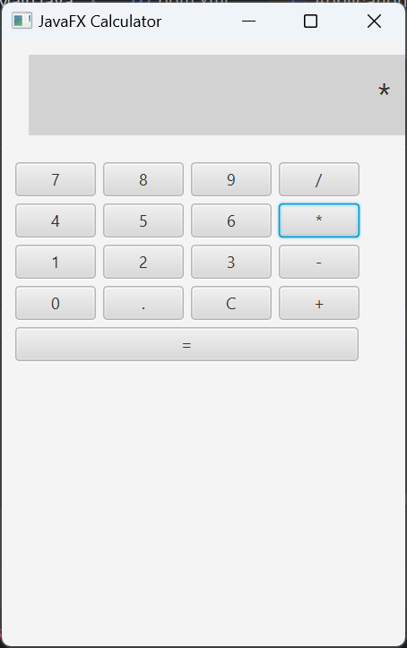

# JavaFX Calculator

A clean and functional desktop calculator application developed in Java using *JavaFX*.  
Built entirely through code (no FXML), this project showcases GUI layout, event handling, and basic arithmetic logic.

---

## 🖥 Features

- Developed in *Java* using *JavaFX*
- UI built *programmatically* (no FXML)
- Display output handled via Label
- Supports operations:  
  ➕ Addition  
  ➖ Subtraction  
  ✖ Multiplication  
  ➗ Division
- Clear (C) and equals (=) functionality
- Minimal, responsive layout

---

## 🔧 Technology Stack

- *Java 17+*
- *JavaFX SDK* (configured in IntelliJ)
- *IntelliJ IDEA* (with correct VM options for JavaFX)

---

## 📷 Screenshots

> ⚠ Add your screenshots (e.g. build image, app UI) in /images folder

- *UI Preview (JavaFX App):*  
  

---

## ⚙ Run Instructions (IntelliJ IDEA)

1. *Install JavaFX SDK* (if not already).
2. Go to File > Project Structure > Libraries and add JavaFX SDK.
3. Go to Run > Edit Configurations and add VM options:

--module-path /path/to/javafx-sdk/lib --add-modules javafx.controls,javafx.fxml

4. Run Main.java.

---

## 🔄 Calculator Logic

- Button presses update the display Label
- The Logic class handles number parsing and operations
- Operator precedence is managed simply (left to right)

---

## ✨ Future Improvements

- Add decimal point support
- Keyboard input mapping
- Scientific operations (sqrt, power, etc.)
- Expression parser with proper operator precedence

---

## 👤 Developer

*Nibedita Ghosh*  
(https://www.linkedin.com/in/nibedita-ghosh-8460b7319)

---

## 📄 License

This project is licensed under the *MIT License*.

---

> Created with 💡 using JavaFX in IntelliJ IDEA

---

